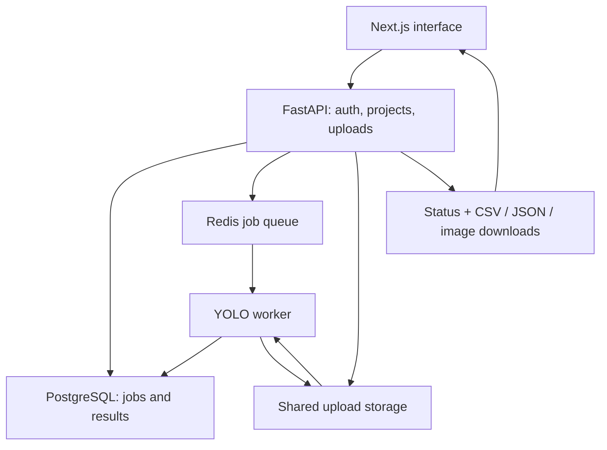

# Tree Counting — End-to-End CV Application

**Image upload → queued inference → inspectable results**

[](https://github.com/asadozzaman/Tree-counting-End-to-End/actions/workflows/ci.yml)

A full-stack tree-detection application built with Next.js, FastAPI, PostgreSQL, Redis, and a YOLO worker. It demonstrates the application around a model: users, projects, uploads, background jobs, status, and downloadable evidence.

**Status:** local application implementation. Published model-accuracy benchmarks, load tests, and production deployment validation are not included.

[Run locally](docs/setup.md) · [API implementation](api/app/main.py) · [Inference worker](worker/app/worker.py) · [Database migrations](api/db/migrations)

## User workflow

1. Register or sign in and create a project.
2. Upload a JPG/PNG image with confidence and NMS IoU thresholds.
3. Follow the job through queued, running, and completed/failed states.
4. Review the annotated image, detection count, mean confidence, and duration.
5. Download CSV/JSON results for further inspection.

The displayed count is the number of detections returned by the configured model and thresholds. Mean confidence is **not a measured accuracy score**.

## Architecture



| Boundary | Why it exists |
| --- | --- |
| API → queue | Accept work separately from the inference process |
| Worker → database | Persist job state, detections, and per-job metrics |
| API + worker → shared volume | Let both processes access input files and generated artifacts |
| API → authenticated user | Associate uploads and results with projects and users |

See [`docker-compose.yml`](docker-compose.yml) for the actual local service wiring. This is a local Compose topology, not a claimed distributed deployment.

## Quick start

Prerequisites: Git, Docker with Compose, and the configured model file.

```bash
git clone https://github.com/asadozzaman/Tree-counting-End-to-End.git
cd Tree-counting-End-to-End
docker compose up -d --build
docker compose exec -T api python scripts/apply_migrations.py
```

Open **http://localhost:3000** for the interface and **http://localhost:8000/docs** for the API. Compose currently loads the included example environments and mounts `tree_yolo26s_best.pt` read-only into the worker. Use trusted weights that you have permission to use; review model and training-data rights before redistribution or commercial use.

The [full setup guide](docs/setup.md) includes migrations, optional seed data, smoke scripts, endpoint reference, troubleshooting, and non-Docker startup.

## Verification

Worker metrics unit tests require neither the model nor a GPU:

```bash
python -m pip install pytest==8.3.4
cd worker
python -m pytest -q tests/test_metrics.py
```

GitHub Actions runs these unit tests and compiles the API/worker Python files. It does **not** run model inference or the full application.

For API integration tests against your isolated local Compose database:

```bash
docker compose exec -T api python -m pytest -q
```

**Use a disposable test database:** the current API tests truncate application tables. The [smoke scripts](api/scripts) exercise queue processing and artifact downloads separately.

## Current limitations and next work

- **Model evaluation:** publish labeled test-set provenance, precision/recall, counting error, and representative failures.
- **Queue reliability:** add and test retries, recovery after worker crashes, and idempotent processing.
- **Deployment:** replace development credentials, add HTTPS and access/retention controls, and validate the complete stack before external use.
- **Startup:** move the worker's runtime OS-package installation into its image build.
- **Repository hygiene:** temporary build files and sample uploads need a provenance/cleanup review.
- **Demo:** capture a reproducible end-to-end walkthrough using redistributable sample images.

Built by [Md. Asadozzaman](https://github.com/asadozzaman), Senior AI Engineer focused on Computer Vision and production AI systems.
